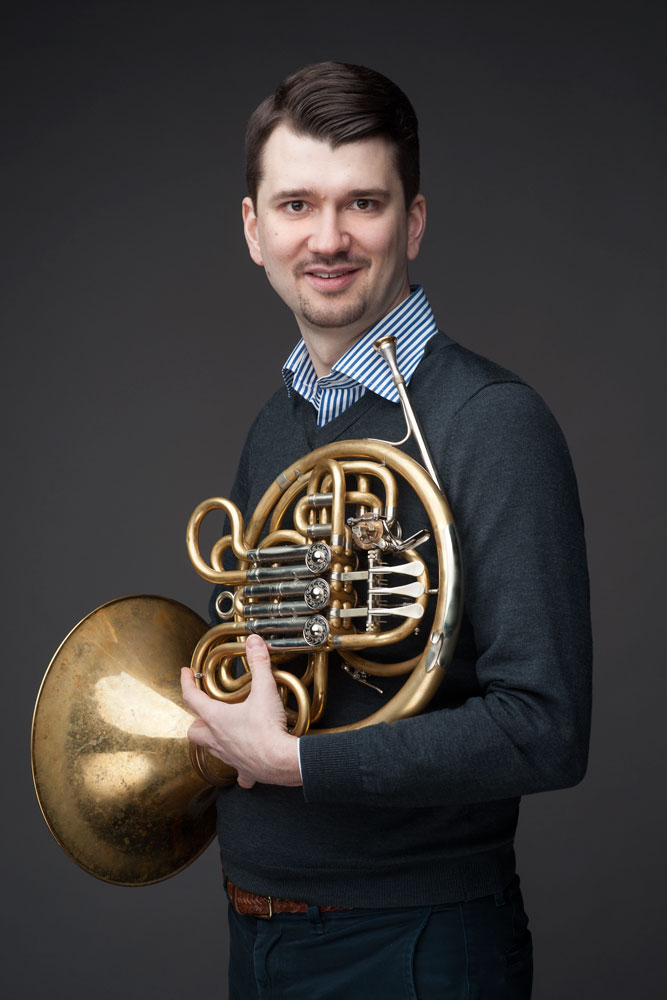
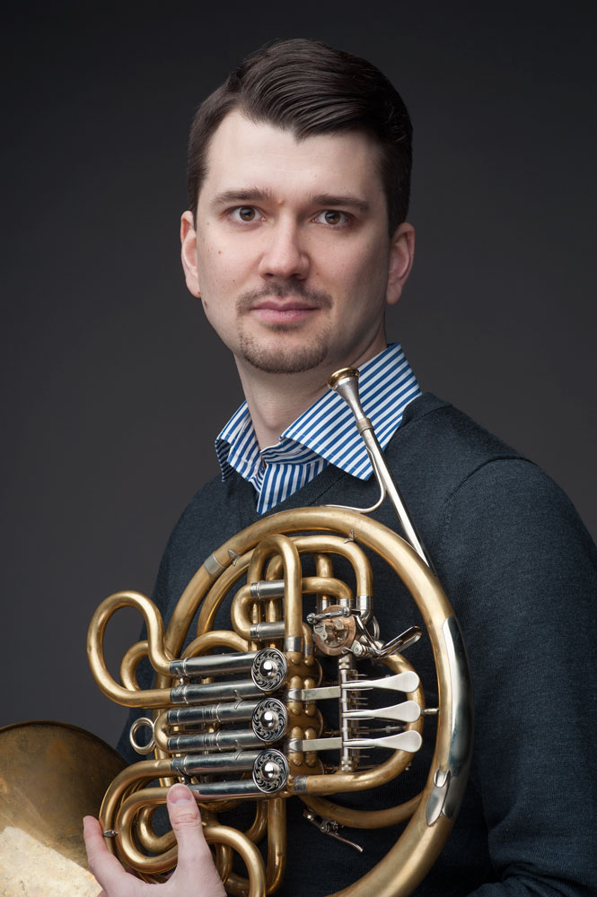

## Biography

Julius Pranevičius is a professor for horn at the Norwegian Academy of Music. He has previously been the principal horn at the Norwegian Radio Orchestra. Julius is an active soloist and has premiered several works for horn. Julius regularly appears in chamber music festivals as well as a guest principal horn with the leading orchestras across Scandinavia.

Julius Pranevičius, originally from Vilnius, Lithuania, received his first horn lessons at the age of 10, later continuing his studies in Lithuania, Norway and Germany. In 2011 he was appointed as the professor at the Norwegian Academy of Music, becoming the youngest professor in Norway at the time.

Julius is the winner of several international music competitions.

## Photos

